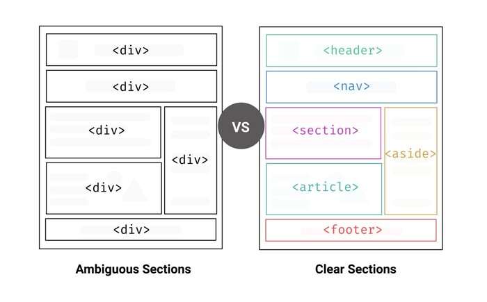

# HTML semântico
#### [HTML semântico](https://www.youtube.com/watch?v=tAFRHcEH-Pc)

#### Tópicos
- **O que é HTML semântico?**
  - Tags de HTML que dão significado ao elemento.
  - Isso ajuda a estruturar melhor o site.
  - Contribui para o SEO da página.
  - Elementos não semânticos:
    - div
    - span
  - Elementos semânticos:
    - article
    - aside
    - details
    - figcaption
    - figure
    - footer
    - header
    - main
    - mark
    - nav
    - section
    - summary
    - time
- **Estrutura da página com semântica**
  - Ao adicionar elementos semânticos podemos estruturar nossa página.
  - Cada seção do site tem uma tag que faz sentido ao elemento.
  - Isso até facilita a manutenção do projeto.
  -
  - 
- **Section**
  - A tag section define uma seção no documento.
  - Geralmente um agrupamento por categorias, exemplo:
    - Seção de produtos.
    - Seção de contato.
  - Provavelmente uma elemento que será utilizado muitas vezes em um projeto.
- **Article**
  - A tag article é utilizada para elementos informativos.
  - Podemos aplicar em, post de blog, comentários e card de produtos.
  - O conteúdo é individual, não fazendo relação com outro elemento ou article.
- **Header**
  - A tag header é utilizada para um conteúdo de introdução ou links de navegação.
  - Podemos ter mais de um header por página.
- **Footer**
  - A tag footer é utilizada como rodapé de página, última seção do site.
  - Mas também pode ser utilizada em outras tag que precisam deste último elemento.
- **Nav**
  - A tag nav é utilizada para demarcar blocos de navegação.
  - Ou seja, é esperado que haja links dentro desta tag.
  - E nem todo link precisa estar numa nav.
  - Costumeiramente são blocos grandes de links, exemplo, barra de navegação principal.
- **Referências**
  - [MDN](https://developer.mozilla.org/pt-BR/docs/Web/HTML)
  - [w3schools](https://www.w3schools.com/html/html5_semantic_elements.asp)